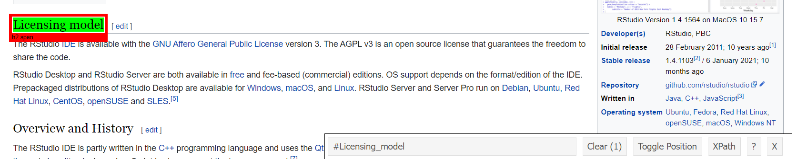
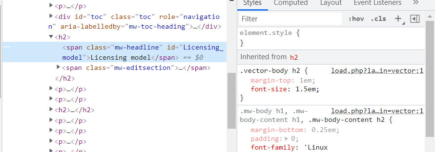
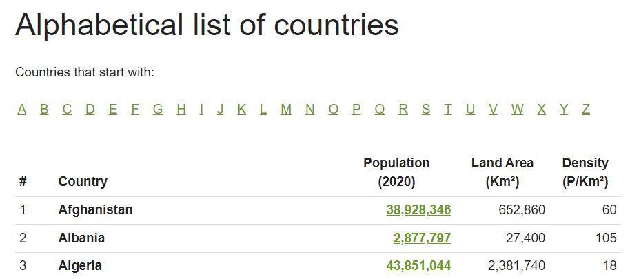
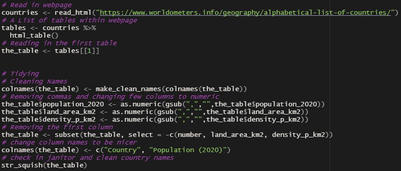
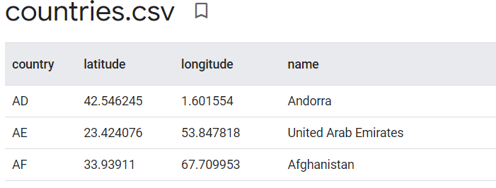
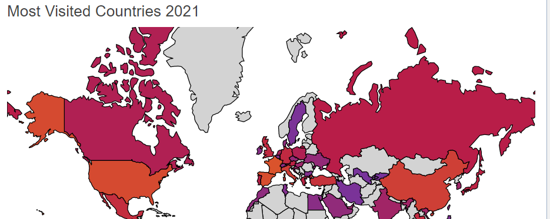

```{r setup, include=FALSE}
knitr::opts_chunk$set(echo = TRUE)
```

## Introduction
 
I always found it difficult to find perfectly organized, clean data on online websites. Because of this I decided to learn how to scrape webpages for the specific things that I needed. Whatever table, paragraph, or hidden image I wanted, I could grab off and import into R studio. From there, I can better clean and rearrange the data to my specific needs, producing a perfect image or data frame.

## The Basics

The fist step to web scraping is reading in a webpage. This is done simply by: **read_html("webpage")**. Once a webpage is read in, you can begin gathering data. The easiest way to import any data is to search for tables within a website: **html_tables()**, this gives you an output of every table within a webpage that you can then search through. By specifying a table: **table <- tables[[1]]**, you can import an entire data set into R studio and begin your data manipulation.
\
\
If you are searching though paragraphs or images for multiple, specific terms you must use an HTML element. By downloading a plug-in titled: **SelectorGadget**, you are able to highlight any part of a webpage and grab the CSS or XPath element. When scraping an HTML element, you must read it in through its "path". This allows R to scan an HTML document and look for the specific data that you want.
\
\


\
\
\
**If you are curious where these paths are located, you can inspect an element. This brings up the actual HTML website code shown below.** Each line represents an element to a certain website. Paragraphs, sentences, headers, tables, pictures, anything you can think of is tracked through this code. This may seem difficult to read but once you know what you are looking for, you can "search" and extract specific text from any website into R studio. 
\
\
\


\
\
\


## The First Webpage

A typical website will have either a built "table", paragraph or a type of image explaining a certain topic. This is difficult to manipulate and gain any actual data from. My first website contained certain demographics about each world country. It looked a little like this:
\
\
\




\
\
\

By using the SelectorGadget and importing the websites tables I was able to gather information about each country (population, land area, and density). Once imported, the data was disorganized and a bit messy. Through some cleaning, rearranging, and time I was able to create a data frame in R with the information that I wanted. Below is an example of the code needed to import and clean data from a website.

\
\
\


\
\
\

After I had gathered all my data, I wanted to put it to use. Combining some other packages I created a scroll table that can be saved as an HTML document and imported into any website or presentation. This was how I chose to present the data scraped from a webpage; however, the data was saved as a data.frame within R. The same code could be ran on another computer and manipulated in any way that is needed.
\
\
\

```{r echo=FALSE}
htmltools::includeHTML("First_webpage/table.html")
```
\
\
\

## The Second Webpage

To show extra manipulation of the data I wanted to make a more interactive display of the previous list of countries. I found a separate website that provided me with the latitude and longitude of every country, this I could use to create a world map. To complete this task, I web scraped the below table into a separate data.frame within R. Combining my previous df and this one, I created a full list of countries, their lat/long, and populations.
\
\
\




\
\
\

**Combining web scraping with other packages I was able to produce an interactive map of the world.**

\
___

## [*Click here for an interactive map*](./Second_Webpage/map.html)

___

## The Third Webpage

For my final push of learning web scraping, I wanted to be a little more creative. I found a website that listed most visited countries within a map. The website with the above information was a little more tricky. Using the HTML inspector code, I was able to pinpoint the top visited countries within the websites map and scrape the data into R studio.




\
\
This df was then combined through R code with a second CSV file of top visited tourist attractions to create the below table. This graphs shows the amount of tourist arrivals and when each bar is hovered over, the top tourist attraction in each country.
\

___

## [*Click here for an interactive graph*](./Fourth_Webpage/p.html)

___


## Conclusion

Not only was I able to master the art of web scraping but I also learned some valuable packages such as XML2, rvest, janitor, KableExtra, HTMLWidgets, and plotly. No longer will I be hand coping every data set into excel file to use at a later date. I can now run code through any website and gather the data that I need to right from R studio. I have also learned some useful skills about map making, using widgets, R markdown, and the interesting world of HTML.
\

Importing any data from a website can be time consuming and tedious. Having to move statistics, data, and research into an excel graph and then import into R can lead to errors and complications. With web scraping I am able to avoid all of the middle man. The greatest skill that I learned from web scraping is taking an online table and importing it directly into R studio where I can clean, manipulate, and produce statistical data. I can now take that data and turn it into a paper worthy of publication.

\
\
\
\
\
\